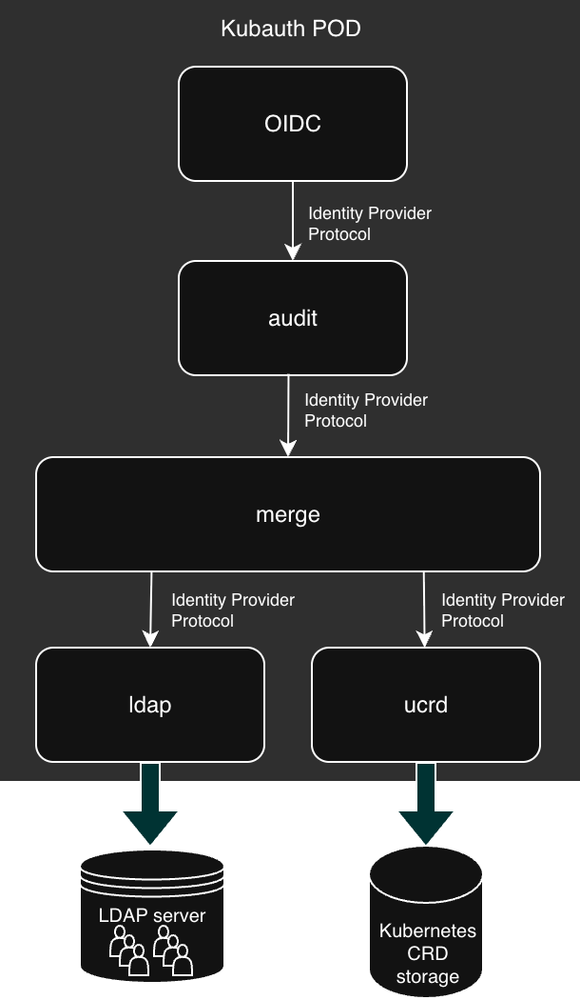

# Multiple Identity Providers

In the previous chapter, we replaced our local user database with an external LDAP server. But what if we want to have both?

## Configuration

Kubauth provides another built-in module: the `merger`.

Here is our target architecture:

{ .center width="60%" }

Here is a values file to implement it:

???+ abstract "values-merger.yaml"

    ``` { .yaml .copy }
    oidc:
      issuer: https://kubauth.ingress.kubo6.mbp
      postLogoutURL: https://kubauth.ingress.kubo6.mbp/index
      allowPasswordGrant: true
    
      ingress:
        host: kubauth.ingress.kubo6.mbp
    
      server:
        certificateIssuer: cluster-odp
    
    audit:
      idProvider:
        baseURL: http://localhost:6804 # Merger listening port
    
    merger:
      enabled: true
      idProviders:
        - name: ldap
          httpConfig:
            baseURL: http://localhost:6803 # ldap provider listening port
        - name: ucrd
          httpConfig:
            baseURL: http://localhost:6802 # ucrd provider listening port
    
    ucrd:
      enabled: true
    
    ldap:
      enabled: true
      ldap:
        host: openldap.openldap.svc
        insecureNoSSL: true
        bindDN: cn=admin,dc=mycompany,dc=com
        bindPW: admin123
        timeoutSec: 10
        groupSearch:
          baseDN: ou=Groups,dc=mycompany,dc=com
          filter: (objectClass=posixgroup)
          linkGroupAttr: memberUid
          linkUserAttr: uid
          nameAttr: cn
        userSearch:
          baseDN: ou=Users,dc=mycompany,dc=com
          cnAttr: cn
          emailAttr: mail
          filter: (objectClass=inetOrgPerson)
          loginAttr: uid
          numericalIdAttr: uidNumber
    ```

- The `audit` module is now connected to the `merger` module.
- The `merger` module is configured with a list of two identity providers. We will see in the next chapter that order is important.
- The `ucrd` module is enabled.
- The `ldap` module configuration is the same as in the previous chapter.

Once your configuration is ready, proceed with deployment by running the `helm upgrade ...` command:

``` { .bash .copy }
helm -n kubauth upgrade -i kubauth --values ./values-merger.yaml oci://quay.io/kubauth/charts/kubauth --version 0.1.2-snapshot --create-namespace --wait
```

Verify which containers have been deployed:

``` { .bash .copy }
kubectl -n kubauth get pod -l app.kubernetes.io/instance=kubauth -o jsonpath='{range .items[0].spec.containers[*]}{.name}{"\n"}{end}'
```
```bash
oidc
audit
merger
ucrd
ldap
```

If you have followed this manual, the `ucrd` module was previously removed, so all its content is gone. You must restore it:

``` { .bash .copy }
kubectl apply -f users.yaml
kubectl apply -f group1.yaml
kubectl apply -f group2.yaml 
```

## Logins

Test authentication:


``` { .bash .copy }
kc token --issuerURL https://kubauth.ingress.kubo6.mbp --clientId public -d
```

Run this command twice: once with `bob/bob123` and again with `john/john123`.

Verify that both users' claims are properly populated.


## Audit

If you review the login attempts:

``` { .bash .copy }
kc audit logins
```
```
WHEN           LOGIN   STATUS            UID   NAME         GROUPS       CLAIMS                                      EMAILS                  AUTH
Thu 12:14:32   bob     passwordChecked   -     Bob MORANE   [staff]      {}                                          [bob@mycompany.com]     ldap
Thu 12:14:18   john    passwordChecked   -     John DOE     [devs,ops]   {"accessProfile":"p24x7","office":"208G"}   [johnd@mycompany.com]   ucrd
```

Notice the rightmost column `AUTH` (AUTHORITY), which now indicates the identity provider that validated the password.
