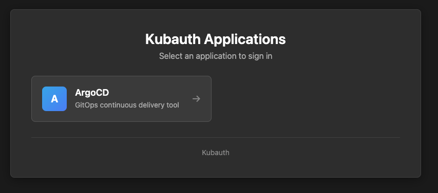

# kc logout

## Overview

The `kc logout` command clears your authentication session with Kubauth. It performs two actions: clears local token cache and terminates the SSO session on the Kubauth server.

## Syntax

```bash
kc logout [options]
```

## Flags

### `--issuerURL`

The Kubauth OIDC issuer URL.

**Example:** `--issuerURL https://kubauth.example.com`

Value may also be fetched from `KC_ISSUER_URL` environment variable, or Kubernetes kubeconfig if `kc init ....` has been used.

-----
### `--insecureSkipVerify`
Skip TLS certificate verification. Use only for testing with self-signed certificates.

**Example:** `--insecureSkipVerify`

-----
### `--caFile`
Provide a CA file for TLS certificate verification of ìssuerURL

**Example:** `--caFile ./CA.crt`

----
### `--browser`

Override default browser. Possible values:

- `chrome`
- `firefox`
- `safari`


----
### `--sso` 

Only clear the SSO session on Kubauth server. Does not logout of `kubectl` session, if any

## Examples


```bash
kc logout --issuerURL https://kubauth.example.com
```

**Output:**
```
No OIDC configuration found in kubeconfig
Opening browser to logout endpoint: https://kubauth.example.com/oauth2/logout
```

!!! note
    The "No OIDC configuration found" means `kubectl` has not being configured with `kc init ....`. Use `--sso` option to remove the message


## Behavior

### What It Does

1. **Clears local cache** - Removes cached tokens from the `kubelogin` plugin, if installed
2. **Opens browser** - Navigates to Kubauth's logout endpoint. This will terminates SSO session by clearing the "Remember me" session cookie

## SSO Session vs Local Cache

### SSO Session (Server-Side, cross application)

- Stored on Kubauth server
- Managed by "Remember me" checkbox
- Shared across all OIDC clients
- Cleared by `kc logout`

### Local Cache (Client-Side, for `kubectl` authentication)

- Need a `kc init ....` client configuration
- Stored by `kubelogin` plugin
- Also cleared by `kc logout`

## Logout Page

After logout, you'll see a page listing available applications:



This page shows OIDC clients with `displayName`, `description`, and `entryURL` configured.


## Troubleshooting

### TLS Certificate Errors

**Error:**
```
Error: x509: certificate signed by unknown authority
```

**Solutions:**

- Use `--insecureSkipVerify` for testing (not recommended for production)
- Use `--caFile ./ca.crt`. To extract the CA:
   ```bash
   kubectl -n kubauth get secret kubauth-oidc-server-cert \
     -o=jsonpath='{.data.ca\.crt}' | base64 -d > ca.crt
   ```
- Add this CA certificate to system trust store.

## Related Commands

- [`kc token`](130-token.md) - Authenticate and get tokens
- [`kc whoami`](170-whoami.md) - Check current authentication
- [`kc config`](190-config.md) - Configure kubectl

## See Also

- [SSO Session](../30-user-guide/140-sso.md)
- [Workstation Setup](../50-kubernetes-integration/140-workstation-setup.md#logout)

