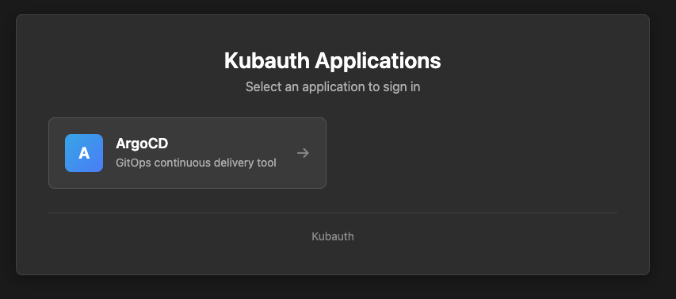

# kc logout

## Overview

The `kc logout` command clears your authentication state with Kubauth. It can perform two independent actions:

- **SSO logout** — open the browser on the Kubauth `end_session_endpoint` to drop the cross-application "Remember me" cookie.
- **Kubernetes logout** — clear the local kubectl OIDC cache (`kubelogin` cache for exec-plugin contexts, or the `id-token`/`refresh-token` fields of the `oidc` auth provider for standalone contexts).

If neither `--sso` nor `--k8s` is given, **both** actions are performed.

## Syntax

```bash
kc logout [--sso] [--k8s] [options]
```

## Action Flags

### `--sso`, `-s` { #sso }

<p class="api-meta">
<span class="api-badge api-type">bool</span>
<span class="api-badge api-default">default: <code>false</code></span>
</p>

Perform only the SSO logout (opens a browser on the Kubauth `end_session_endpoint`).

<hr class="api-field-separator">

### `--k8s`, `-k` { #k8s }

<p class="api-meta">
<span class="api-badge api-type">bool</span>
<span class="api-badge api-default">default: <code>false</code></span>
</p>

Perform only the kubectl/Kubernetes logout (clears the local kubectl OIDC cache).

!!! info

    When neither `--sso` nor `--k8s` is set, both actions are performed.

## Connection Flags

| Flag                                   | Type   | Default                               | Env var             |
|----------------------------------------|--------|---------------------------------------|---------------------|
| `--issuerURL`, `-i`                    | string | from kubeconfig                       | `KC_ISSUER_URL`     |
| `--insecureSkipVerify`                 | bool   | `false`                               | —                   |
| `--caFile` <small>(repeatable)</small> | string | —                                     | —                   |
| `--kubeconfig`                         | string | `$KUBECONFIG` or `$HOME/.kube/config` | —                   |
| `--context`                            | string | kubeconfig `current-context`          | —                   |
| `--logMode`                            | string | `text`                                | —                   |
| `--logLevel`, `-l`                     | string | `INFO`                                | —                   |
| `--dumpClientExchanges`                | bool   | `false`                               | —                   |

!!! info "About `--issuerURL`"

    The issuer URL is required for the SSO logout (used to discover the `end_session_endpoint`). When omitted, `kc` falls back to the issuer URL recorded in the current kubeconfig.

## Browser Flag

### `--browser` { #browser }

<p class="api-meta">
<span class="api-badge api-type">string</span>
<span class="api-badge api-default">default: OS-level default browser</span>
</p>

Override the default browser used for the SSO logout. Possible values: `chrome`, `firefox`, `safari`.

## Examples

### Full logout (default)

```bash
kc logout --issuerURL https://kubauth.example.com
```

If a kubectl OIDC context is configured:

```
CLeaning kubelogin OIDC configuration if any
Opening browser to logout endpoint: https://kubauth.example.com/oauth2/sessions/logout
```

If no kubectl OIDC context is configured:

```
No OIDC configuration found in kubeconfig
Opening browser to logout endpoint: https://kubauth.example.com/oauth2/sessions/logout
```

!!! note

    The "No OIDC configuration found in kubeconfig" message simply means kubectl has not been configured via `kc config` / `kc init`. Pass `--sso` to skip the kubectl-side logout entirely (and suppress that message).

### SSO logout only

```bash
kc logout --issuerURL https://kubauth.example.com --sso
```

### Kubectl logout only

```bash
kc logout --k8s
```

This does not open a browser. It uses the current kubeconfig to locate the OIDC configuration and clears the local cached tokens.

### Issuer URL inferred from kubeconfig

When kubectl was previously configured with `kc config` / `kc init`, the issuer URL can be omitted:

```bash
kc logout
```

## Behavior

### What It Does

1. **kubectl logout** (`--k8s`, default) — based on the kind of OIDC context:
    - **Exec-plugin context (default mode):** runs `kubectl oidc-login clean` to drop the `kubelogin` cache.
    - **Standalone context (`kc config --standalone`):** removes the `id-token` and `refresh-token` fields from the kubeconfig `oidc` auth provider entry.
2. **SSO logout** (`--sso`, default) — discovers the `end_session_endpoint` from `/.well-known/openid-configuration` and opens it in the browser. This clears the cross-application Kubauth SSO session cookie.

### SSO Session vs Local Cache

#### SSO session (server-side, cross-application)

- Stored as a cookie on the Kubauth domain.
- Created when the user ticks "Remember me".
- Shared by all OIDC clients of the same Kubauth server.
- Cleared by `kc logout --sso`.

#### Local cache (client-side, kubectl only)

- Stored locally (kubelogin cache or kubeconfig fields).
- Only used by `kubectl` exec-plugin.
- Cleared by `kc logout --k8s`.

## Logout Page

After SSO logout, Kubauth displays a page listing available applications:



This page lists the OIDC clients that have `displayName`, `description`, and `entryURL` configured.

## Troubleshooting

### TLS Certificate Errors

Error:

```
Error: x509: certificate signed by unknown authority
```

Solutions:

- Use `--insecureSkipVerify` for testing (not recommended for production).
- Provide a CA: `--caFile ./ca.crt`. To extract it:
   ```bash
   kubectl -n kubauth get secret kubauth-oidc-server-cert \
     -o=jsonpath='{.data.ca\.crt}' | base64 -d > ca.crt
   ```
- Or add the CA to the system trust store.

## Related Commands

- [`kc token`](130-token.md) — Authenticate and get tokens
- [`kc whoami`](170-whoami.md) — Check current authentication
- [`kc config`](190-config.md) — Configure kubectl

## See Also

- [SSO Session](../30-user-guide/140-sso.md)
- [Workstation Setup](../50-kubernetes-integration/140-workstation-setup.md#logout)
